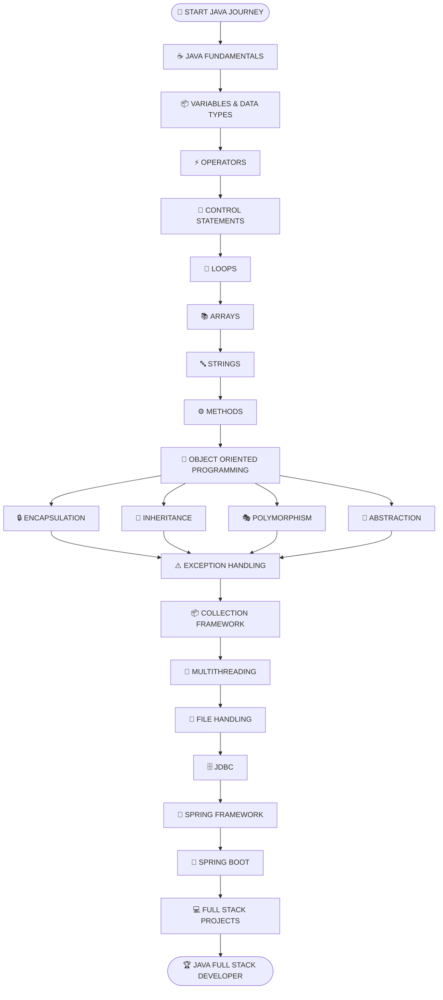
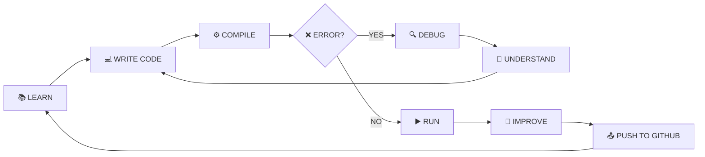

<!-- ========================================================= -->
<!--                 JAVA PRACTICE README                      -->
<!--                    ROHIT PANDEY                            -->
<!-- ========================================================= -->

<div align="center">


</div>

<div align="center">


</div>

<br>

<div align="center">


</div>

<br>

<div align="center">

```text
╔════════════════════════════════════════════════════════════════╗
║                                                                ║
║       ██╗ █████╗ ██╗   ██╗ █████╗                              ║
║       ██║██╔══██╗██║   ██║██╔══██╗                             ║
║       ██║███████║██║   ██║███████║                             ║
║  ██   ██║██╔══██║╚██╗ ██╔╝██╔══██║                             ║
║  ╚█████╔╝██║  ██║ ╚████╔╝ ██║  ██║                             ║
║   ╚════╝ ╚═╝  ╚═╝  ╚═══╝  ╚═╝  ╚═╝                             ║
║                                                                ║
║                 JAVA DEVELOPMENT SYSTEM                        ║
║                                                                ║
║             WRITE  →  COMPILE  →  RUN  →  LEARN                ║
║                                                                ║
╚════════════════════════════════════════════════════════════════╝
```

</div>

---

# ⚡ JAVA SYSTEM INITIALIZATION

```console
rohit@java-developer:~$ start java-practice

[ SYSTEM ] Starting Java Development Environment...

████████████████████████████████████████ 100%

[ OK ] JDK Environment Loaded
[ OK ] Java Compiler Found
[ OK ] JVM Started
[ OK ] Eclipse IDE Connected
[ OK ] Practice Repository Found
[ OK ] Daily Coding System Activated
[ OK ] Developer Mode Enabled

LANGUAGE    : JAVA
PLATFORM    : JDK
RUNTIME     : JVM
PARADIGM    : OBJECT-ORIENTED PROGRAMMING
REPOSITORY  : JAVA PRACTICE
STATUS      : ONLINE

MISSION     : LEARN → CODE → COMPILE → DEBUG → IMPROVE

rohit@java-developer:~$ _
```

---

<div align="center">

# ☕ WELCOME TO MY JAVA JOURNEY


</div>

Welcome to my **Java Practice Repository**.

This repository is a digital record of my journey into the world of Java programming, problem-solving, object-oriented programming, backend development, and software engineering.

Here, I upload my daily:

- ☕ Java programs
- 💻 Coding practice
- 🧠 Programming concepts
- 🐞 Errors and debugging solutions
- 📝 Learning notes
- ⚙️ OOP examples
- 🔥 Logic-building programs
- 🚀 Developer progress

Every `.java` file inside this repository represents another step forward in my journey to becoming a **Java Full Stack Developer**.

```java
public class DeveloperJourney
{
    public static void main(String[] args)
    {
        String developer = "Rohit Pandey";
        String currentSkill = "Java Programming";
        String dream = "Java Full Stack Developer";

        while(true)
        {
            learn();
            practice();
            makeMistakes();
            debug();
            understand();
            improve();
        }
    }
}
```

---

# 🔥 WHAT IS JAVA?

**Java** is a high-level, class-based, object-oriented programming language designed to create reliable, secure, and platform-independent applications.

One of Java's most famous concepts is:

<div align="center">

## ☕ WRITE ONCE, RUN ANYWHERE

</div>

Java source code is compiled into **Bytecode**, which can run on any system that has a compatible **Java Virtual Machine (JVM)**.

```text
┌─────────────────────────────────────────────────────────────┐
│                                                             │
│                    📄 JAVA SOURCE CODE                      │
│                         .java                               │
│                           │                                 │
│                           ▼                                 │
│                    ⚙️ JAVA COMPILER                        │
│                         javac                               │
│                           │                                 │
│                           ▼                                 │
│                      📦 BYTECODE                            │
│                         .class                              │
│                           │                                 │
│                           ▼                                 │
│                         ☕ JVM                              │
│                           │                                 │
│              ┌────────────┼────────────┐                    │
│              ▼            ▼            ▼                    │
│          🪟 WINDOWS     🐧 LINUX      🍎 macOS              │
│                                                             │
└─────────────────────────────────────────────────────────────┘
```

---

# 🧠 JDK • JRE • JVM ARCHITECTURE

```text
╔══════════════════════════════════════════════════════════════╗
║                         ☕ JDK                               ║
║                                                              ║
║    Java Development Kit                                      ║
║                                                              ║
║    ┌────────────────────────────────────────────────────┐    ║
║    │                    ⚙️ JRE                          │    ║
║    │                                                    │    ║
║    │    Java Runtime Environment                        │    ║
║    │                                                    │    ║
║    │    ┌──────────────────────────────────────────┐    │    ║
║    │    │                🧠 JVM                    │    │    ║
║    │    │                                          │    │    ║
║    │    │       Java Virtual Machine               │    │    ║
║    │    │                                          │    │    ║
║    │    └──────────────────────────────────────────┘    │    ║
║    │                                                    │    ║
║    └────────────────────────────────────────────────────┘    ║
║                                                              ║
║    + Compiler + Debugger + Development Tools                  ║
║                                                              ║
╚══════════════════════════════════════════════════════════════╝
```

---

# 🛰️ LIVE JAVA DEVELOPER TERMINAL

```console
┌──(rohit㉿java-developer)-[~/Java-Practice]
│
├── $ whoami
│
│   Rohit Pandey
│   B.Tech Computer Science Graduate
│   Aspiring Java Full Stack Developer
│
├── $ current_language
│
│   Java ☕
│
├── $ current_mission
│
│   Core Java → OOP → Advanced Java → Spring → Full Stack
│
├── $ repository_status
│
│   ● ACTIVE
│
├── $ developer_mode
│
│   LEARNING + CODING + DEBUGGING
│
├── $ daily_progress
│
│   ████████████████████░░░░░░░░░░ LEARNING...
│
└── $ _
```

---

# 🗺️ COMPLETE JAVA LEARNING ROADMAP



---

# ☕ CORE JAVA COMMAND CENTER

<table>
<tr>

<td align="center" width="25%">

## 📦 BASICS

```text
Variables
Data Types
Operators
Type Casting
Input / Output
```

</td>

<td align="center" width="25%">

## 🔀 CONTROL FLOW

```text
if
if-else
switch
for
while
do-while
```

</td>

<td align="center" width="25%">

## 🧠 OOP

```text
Class
Object
Inheritance
Polymorphism
Abstraction
Encapsulation
```

</td>

<td align="center" width="25%">

## ⚡ ADVANCED

```text
Collections
Exceptions
Threads
Files
JDBC
```

</td>

</tr>
</table>

---

# 🧬 OBJECT-ORIENTED PROGRAMMING UNIVERSE

```text
                           🧠 OOP
                              │
            ┌─────────────────┼─────────────────┐
            │                 │                 │
            ▼                 ▼                 ▼
        📦 CLASS          🎯 OBJECT         ⚙️ METHOD
            │
            ▼
    ┌───────┴──────────────────────────────────┐
    │                                          │
    ▼                                          ▼
🔒 ENCAPSULATION                         🧬 INHERITANCE
    │                                          │
    ▼                                          ▼
🎭 POLYMORPHISM                         🎨 ABSTRACTION
    │                                          │
    └──────────────────┬───────────────────────┘
                       │
                       ▼
              🚀 REUSABLE & SECURE CODE
```

---

# 📂 REPOSITORY ARCHITECTURE

```text
📦 Java-Practice
│
├── 📁 Day01
│   │
│   ├── 📄 Program01.java
│   ├── 📄 Program02.java
│   └── 📄 Practice.java
│
├── 📁 Day02
│   │
│   ├── 📄 Variables.java
│   ├── 📄 DataTypes.java
│   └── 📄 Operators.java
│
├── 📁 Day03
│   │
│   ├── 📄 IncrementOperator.java
│   ├── 📄 DecrementOperator.java
│   └── 📄 Practice.java
│
├── 📁 Upcoming
│   │
│   ├── 🔒 ControlStatements.java
│   ├── 🔒 Loops.java
│   ├── 🔒 Arrays.java
│   └── 🔒 OOP.java
│
└── 📖 README.md
    │
    └── 👀 YOU ARE HERE
```

---

# 📚 JAVA KNOWLEDGE MATRIX

| MODULE | CONCEPT | STATUS |
|:---:|:---|:---:|
| 01 | Java Introduction | 🟢 COMPLETED |
| 02 | JDK, JRE & JVM | 🟢 COMPLETED |
| 03 | Variables | 🟢 COMPLETED |
| 04 | Data Types | 🟢 COMPLETED |
| 05 | Operators | 🔵 PRACTICING |
| 06 | Increment & Decrement | 🔵 PRACTICING |
| 07 | Control Statements | 🟡 LEARNING |
| 08 | Loops | ⚪ UPCOMING |
| 09 | Arrays | ⚪ UPCOMING |
| 10 | Strings | ⚪ UPCOMING |
| 11 | Methods | ⚪ UPCOMING |
| 12 | OOP Concepts | 🔒 LOCKED |
| 13 | Exception Handling | 🔒 LOCKED |
| 14 | Collections | 🔒 LOCKED |
| 15 | Multithreading | 🔒 LOCKED |
| 16 | JDBC | 🔒 LOCKED |
| 17 | Spring Boot | 🔒 FUTURE MISSION |

---

# 📊 JAVA DEVELOPER SKILL SYSTEM

```text
╭────────────────────────────────────────────────────────────╮
│                                                            │
│   JAVA FUNDAMENTALS                                        │
│   ████████████████████████████████████░░░░   90%           │
│                                                            │
│   VARIABLES & DATA TYPES                                   │
│   ████████████████████████████████████████  100%           │
│                                                            │
│   OPERATORS                                                │
│   ████████████████████████████████░░░░░░░░   80%           │
│                                                            │
│   CONTROL STATEMENTS                                       │
│   ████████████████████░░░░░░░░░░░░░░░░░░░░   50%           │
│                                                            │
│   OBJECT ORIENTED PROGRAMMING                              │
│   ████████░░░░░░░░░░░░░░░░░░░░░░░░░░░░░░░░   20%           │
│                                                            │
│   ADVANCED JAVA                                            │
│   ░░░░░░░░░░░░░░░░░░░░░░░░░░░░░░░░░░░░░░░░    0%           │
│                                                            │
│   SPRING BOOT                                              │
│   ░░░░░░░░░░░░░░░░░░░░░░░░░░░░░░░░░░░░░░░░    0%           │
│                                                            │
╰────────────────────────────────────────────────────────────╯
```

---

# ⚙️ HOW JAVA CODE ACTUALLY RUNS


---

# 🔥 DYNAMIC JAVA CODE EXPERIENCE

```java
public class JavaDeveloper
{
    private String name;
    private String currentSkill;
    private String dream;

    public JavaDeveloper(String name)
    {
        this.name = name;
        this.currentSkill = "Core Java";
        this.dream = "Java Full Stack Developer";
    }

    public void startJourney()
    {
        boolean success = false;

        while(!success)
        {
            learn();
            practice();
            makeMistakes();
            debug();
            understand();
            improve();

            System.out.println("Developer Level Increased 🚀");
        }
    }

    private void learn()
    {
        System.out.println("📚 Learning Java...");
    }

    private void practice()
    {
        System.out.println("💻 Writing Programs...");
    }

    private void makeMistakes()
    {
        System.out.println("❌ Finding Errors...");
    }

    private void debug()
    {
        System.out.println("🔍 Debugging Code...");
    }

    private void understand()
    {
        System.out.println("🧠 Understanding Concepts...");
    }

    private void improve()
    {
        System.out.println("🚀 Improving Every Day...");
    }

    public static void main(String[] args)
    {
        JavaDeveloper rohit =
                new JavaDeveloper("Rohit Pandey");

        rohit.startJourney();
    }
}
```

---

# 🧪 MY DAILY DEVELOPMENT CYCLE



---

# 🐞 DEBUGGING SYSTEM

```console
JAVA PROGRAM STARTED...

> Compiling source code...

████████████████████████████████████ 100%

> Checking Syntax..................... OK ✅

> Checking Variables.................. OK ✅

> Checking Methods.................... OK ✅

> Checking Logic...................... ERROR ❌

> Starting Debug Mode................. ACTIVE 🔍

> Finding Problem..................... FOUND ⚠️

> Fixing Code......................... DONE ✅

> Compiling Again..................... SUCCESS ✅

> Executing Program................... SUCCESS 🚀


OUTPUT:

Every Error Makes Me a Better Developer 🔥
```

---

# 🎯 CURRENT DEVELOPER MISSIONS

```text
[████████████████████] Learn Java Fundamentals

[██████████████████░░] Master Variables & Data Types

[████████████████░░░░] Practice Java Operators

[████████████░░░░░░░░] Master Control Statements

[████████░░░░░░░░░░░░] Improve Problem-Solving Skills

[████░░░░░░░░░░░░░░░░] Learn Object-Oriented Programming

[██░░░░░░░░░░░░░░░░░░] Learn Advanced Java

[░░░░░░░░░░░░░░░░░░░░] Master Spring Boot

[░░░░░░░░░░░░░░░░░░░░] Build Full Stack Projects

[░░░░░░░░░░░░░░░░░░░░] Become Java Full Stack Developer
```

---

# 🏆 DEVELOPER ACHIEVEMENT SYSTEM

```text
╔══════════════════════════════════════════════════════════╗
║                                                          ║
║   🟢 JAVA JOURNEY STARTED                                ║
║                                                          ║
║   🟢 FIRST JAVA PROGRAM                                  ║
║                                                          ║
║   🟢 VARIABLES MASTERED                                  ║
║                                                          ║
║   🟢 DATA TYPES MASTERED                                 ║
║                                                          ║
║   🔵 OPERATORS IN PROGRESS                               ║
║                                                          ║
║   🟡 CONTROL STATEMENTS LOADING                          ║
║                                                          ║
║   🔒 OOP MASTER                                          ║
║                                                          ║
║   🔒 ADVANCED JAVA DEVELOPER                             ║
║                                                          ║
║   🔒 SPRING BOOT DEVELOPER                               ║
║                                                          ║
║   🔒 JAVA FULL STACK DEVELOPER                           ║
║                                                          ║
╚══════════════════════════════════════════════════════════╝
```

---

# 👨‍💻 DEVELOPER PROFILE

<div align="center">


<br>

### 🎓 B.Tech Computer Science Graduate

### ☕ Learning Core Java

### 🗄️ Learning Oracle SQL & PL/SQL

### 💻 Practicing Java • SQL • Git • GitHub

### 🎯 Aspiring Java Full Stack Developer

### 🚀 Learning • Coding • Debugging • Improving

</div>

---

# 🧠 DEVELOPER PHILOSOPHY

```java
public class Success
{
    public static void main(String[] args)
    {
        boolean hardWork = true;
        boolean consistency = true;
        boolean givingUp = false;

        if(hardWork && consistency && !givingUp)
        {
            System.out.println("SUCCESS FOUND 🚀");
        }
    }
}
```

---

<div align="center">

# ⚡ FINAL SYSTEM STATUS


<br><br>

### `while(alive) { learn(); code(); improve(); }`

<br>


</div>
